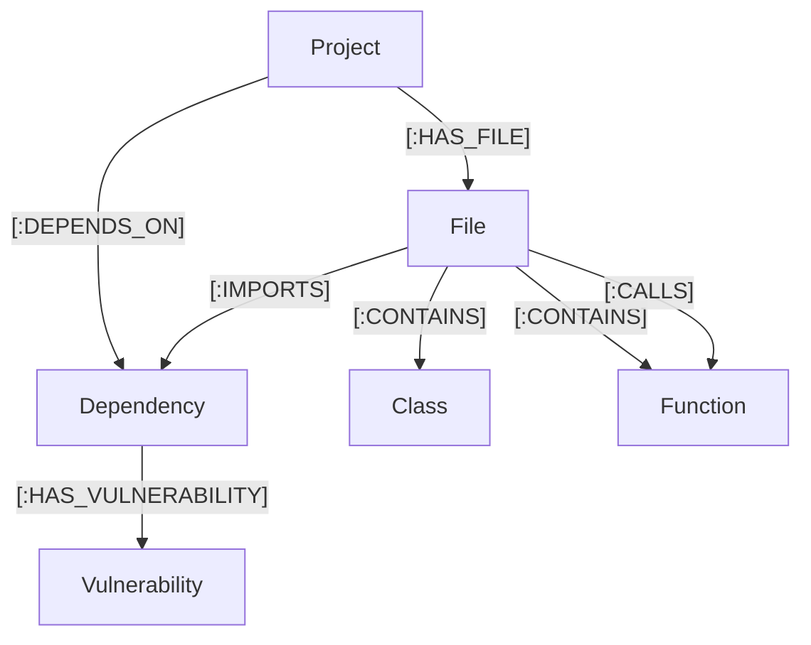

# Cyber Nervous System (CNS) — Technical Documentation
*Autonomous Code Auditing & Software Digital Twin Platform*

This document provides a comprehensive technical overview of the **Cyber Nervous System (CNS)** project located at `D:/projects/rishi/cns-mvp`. It covers the system architecture, code parser pipeline, API layers, Neo4j schema design, and operational instructions.

---

## 1. Executive Summary
The **Cyber Nervous System (CNS)** is a software security "Digital Twin" application. It recursively ingests target source codebases, parses them down to Abstract Syntax Tree (AST) definitions, constructs a relational dependency graph in Neo4j, matches libraries against real-world vulnerability databases (OSV.dev), and applies a Large Language Model (Google Gemini 1.5 Flash) to analyze the resulting graph database for potential security design flaws.

```
┌────────────────────────────────────────────────────────┐
│                     React Frontend                     │
│    - Glassmorphism Canvas Graph (Nodes & Edges)        │
│    - Real-time Log Stream & Audit Panel                │
│    - Cognitive AI Risk Analysis Console                │
└──────────────────────────┬─────────────────────────────┘
                           │ HTTP REST Requests
                           ▼
┌────────────────────────────────────────────────────────┐
│                  FastAPI Backend Server                │
│    - Endpoint Routing (/ingest, /assess-risk, etc.)    │
│    - Multi-threaded Background Job Execution           │
│    - Neo4j Session Driver & Cipher Transaction Manager │
└──────┬───────────────────┬───────────────────┬─────────┘
       │                   │                   │
       ▼                   ▼                   ▼
┌──────────────┐    ┌──────────────┐    ┌──────────────┐
│ Ingestor Engine│  │ OSV.dev API  │    │ Gemini 1.5   │
│ - tree-sitter │  │ - PyPI Vulns │    │ - AI Auditor │
│ - AST Parser  │  │   Lookup     │    │ - Risk Assessment
└──────────────┘    └──────────────┘    └──────────────┘
```

---

## 2. System Architecture

The project is structured into three primary packages:
* **`frontend/`**: Vite + React 19 single-page application representing the dashboard UI.
* **`backend/`**: FastAPI implementation routing requests, executing background ingestion, and querying Neo4j.
* **`ingestor/`**: Core parser engines responsible for AST compilation (`parser.py`) and vulnerability API lookup (`vulnerability_scanner.py`).

### A. Code Ingestor & AST Parsing (`ingestor/parser.py`)
The parser leverages `tree-sitter` (specifically `tree-sitter-python`) to generate concrete syntax trees for Python modules. Instead of performing simple regex strings checks, it parses actual code scopes:
* **Function definitions**: Identifies function boundaries, names, and exact start/end line coordinates.
* **Class definitions**: Detects class definitions and measures scope length.
* **Imports statement**: Extracts imported packages and local module imports.
* **Calls**: Records internal function calls to map call trees and relationships.

### B. Vulnerability Scanner (`ingestor/vulnerability_scanner.py`)
This component parses `requirements.txt` to isolate package dependencies and their pinned versions.
1. The scanner triggers a `POST` request to `https://api.osv.dev/v1/query` containing the package names and versions.
2. The OSV API matches packages against the **PyPI ecosystem database** of open-source vulnerabilities.
3. Identified vulnerability objects (including CVE numbers, GitHub Security Advisories, summaries, and severity) are parsed.
4. The scanner merges them into Neo4j with a `[:HAS_VULNERABILITY]` relation linking back to the target dependency.

### C. Cognitive Security Auditor (Gemini Integration)
Under production mode, the `/assess-risk` endpoint acts as a cognitive security layer:
1. The backend performs a Cypher query on Neo4j for the target file or function, grabbing all related entities and connections (up to 50 nodes).
2. The resulting context (files, function callers, imports, active vulnerabilities) is packaged into a structured prompt.
3. The prompt is sent to Google's `gemini-1.5-flash` model.
4. Gemini returns an autonomous risk score (LOW/MEDIUM/HIGH/CRITICAL), a summary of architectural risk, possible attack vectors, and specific code-level mitigations.

---

## 3. Database Graph Schema
The Neo4j graph maps the target codebase's architectural relationships. 

### Nodes
* **`Project`**: Root node of the scanned repository (property: `name`).
* **`File`**: Represents a physical source code file in the repository (properties: `path`, `project`).
* **`Class`**: Classes defined within a file (properties: `name`, `start_line`, `end_line`, `project`).
* **`Function`**: Functions defined within a file (properties: `name`, `start_line`, `end_line`, `project`).
* **`Dependency`**: Libraries imported by files or declared in requirements (properties: `name`, `version`).
* **`Vulnerability`**: Known CVE/GHSA vulnerabilities mapped from OSV (properties: `id`, `summary`, `details`, `severity`).

### Relationships


---

## 4. API Documentation

The backend serves a FastAPI REST interface running on port `8000`.

| Method | Endpoint | Description |
| :--- | :--- | :--- |
| `GET` | `/` | Checks health status and reports active backend execution mode (MOCK or PRODUCTION). |
| `GET` | `/health` | Diagnostic details showing status of Neo4j driver and Gemini configuration. |
| `GET` | `/graph/stats` | Fetches active node counts categorized by label from Neo4j (used for UI metrics). |
| `GET` | `/graph/vulnerabilities` | Returns parsed list of vulnerabilities and the files importing affected packages. |
| `DELETE` | `/graph/clear` | Purges graph entries associated with the specified `project_name` parameter. |
| `POST` | `/ingest` | Initiates asynchronous AST scanner & OSV vulnerability job in background. |
| `GET` | `/ingest/status` | Returns the current state (`idle`, `running`, `done`, `error`) and progress message. |
| `POST` | `/assess-risk` | Submits file/function entities to the AI cognitive auditor for security threat assessments. |

---

## 5. Configuration & Environment Variables

Create a `.env` file in the `backend/` and `ingestor/` folders to control server runtime behavior:

```env
# Neo4j Connection Credentials
# Set URI to "mock" to run the entire backend and graph canvas in simulation mode
NEO4J_URI=bolt://localhost:7687
NEO4J_USER=neo4j
NEO4J_PASSWORD=supersecretpassword

# Google Gemini API Key (Required for AI Audit assessments)
GEMINI_API_KEY=AIzaSy...

# Optional Configurations
PORT=8000
ALLOWED_ORIGINS=http://localhost:5173,http://localhost:3000
```

---

## 6. How to Run the Application

The application supports a **Mock Simulation Mode** that allows complete offline validation without requiring a live Neo4j instance or Gemini credentials. If `NEO4J_URI=mock` is set, the application generates a complete simulation database in memory.

### Step 1: Initialize the Backend
1. Navigate to the backend directory:
   ```bash
   cd D:/projects/rishi/cns-mvp/backend
   ```
2. Install Python dependencies:
   ```bash
   pip install -r requirements.txt
   pip install -r ../ingestor/requirements.txt
   ```
3. Start the FastAPI development server:
   ```bash
   python main.py
   ```
   *The server runs at [http://localhost:8000](http://localhost:8000).*

### Step 2: Initialize the Frontend
1. Navigate to the frontend directory:
   ```bash
   cd D:/projects/rishi/cns-mvp/frontend
   ```
2. Install dependencies:
   ```bash
   npm install
   ```
3. Start the Vite dev server:
   ```bash
   npm run dev
   ```
   *The client dashboard will run at [http://localhost:5173](http://localhost:5173).*

---

## 7. Next Steps & Enterprise Enhancements
* **Language Agnostic AST Parsers**: Incorporate `tree-sitter-javascript`, `tree-sitter-go`, and `tree-sitter-cpp` libraries inside `parser.py` to enable cross-language code indexing.
* **Transitive Dependency Resolution**: Expand OSV vulnerability analysis to cover nested dependencies instead of only direct top-level requirements.
* **CI/CD Security Gates**: Add a CLI command variant that executes AST ingestion inside pull requests and automatically fails builds if risk severity exceeds defined thresholds.
